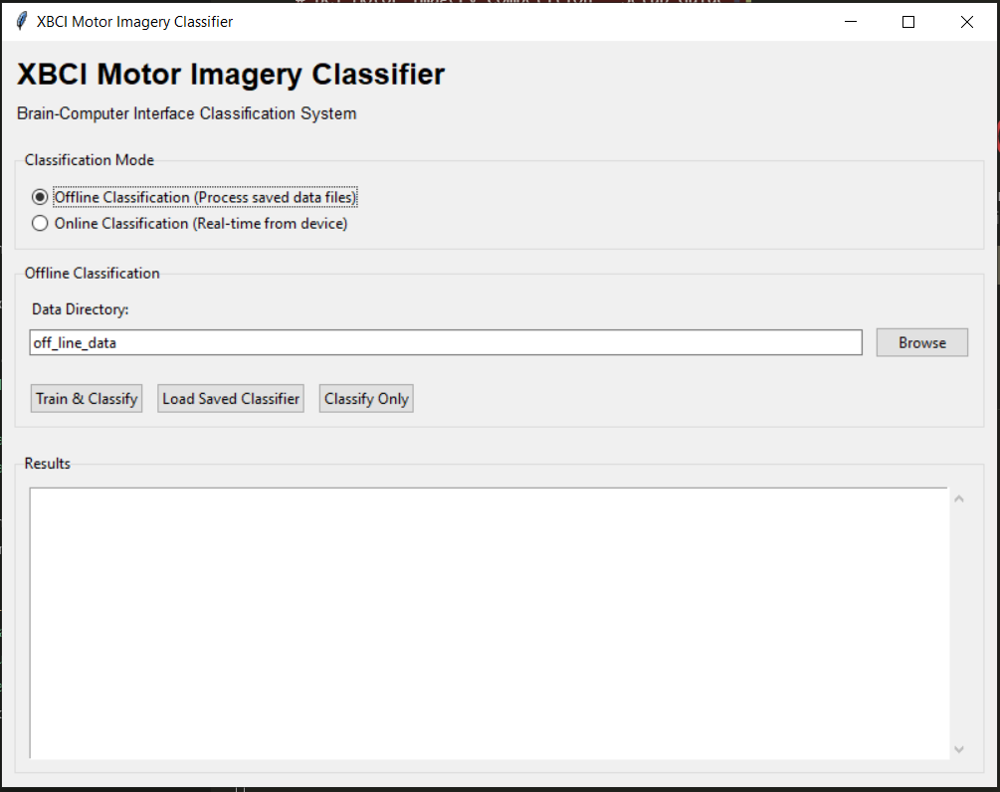

# XBCI Motor Imagery Classifier

A comprehensive Brain-Computer Interface (BCI) system for motor imagery classification with both online and offline capabilities.

## Features

### 🧠 **4-Class Motor Imagery Classification**
- **0**: right_hand
- **1**: left_hand  
- **2**: right_feet
- **3**: left_feet

### 🔄 **Dual Operation Modes**
- **Online Classification**: Real-time classification from live EEG stream
- **Offline Classification**: Batch processing of saved data files

### 🎨 **Professional User Interface**
- Graphical User Interface (GUI) with XBCI logo
- Command Line Interface (CLI) for automation
- Point-and-click operation for easy use

## Quick Start

### 1. Install Dependencies
```bash
pip install -r requirements_bci.txt
```

### 2. Run the GUI (Recommended)
```bash
python simple_bci_gui.py
```
Or double-click `run_bci_gui.bat` on Windows

**GUI Interface Preview:**


### 3. Use Offline Classification
1. Select "Offline Classification" mode
2. Browse to your data directory (default: `off_line_data/`)
3. Click "Train & Classify"
4. View results with class labels 0, 1, 2, 3

### 4. Use Online Classification
1. Select "Online Classification" mode
2. Follow the instructions in the GUI
3. Run: `python bci_motor_imagery_classifier_v2.py`

## File Structure

```
XBCI-competition/
├── simple_bci_gui.py              # Main GUI application
├── bci_cli.py                     # Command-line interface
├── offline_bci_classifier.py      # Offline classification engine
├── bci_motor_imagery_classifier_v2.py  # Online classification engine
├── run_bci_gui.bat               # Windows launcher
├── requirements_bci.txt          # Python dependencies
├── assets_ui/                    # UI assets
│   └── xbci_logo.PNG            # XBCI logo
├── off_line_data/                # Your data directory
│   ├── data_000001.npy
│   ├── data_000002.npy
│   └── ...
├── src/ble_sdk/                  # BLE SDK for device communication
└── offline_bci_classifier.pkl    # Trained classifier (auto-generated)
```

## Usage Options

### Option 1: GUI (Recommended for most users)
```bash
python simple_bci_gui.py
```
- Point-and-click interface
- Real-time results display
- Save/load classifiers
- Export results

### Option 2: Command Line
```bash
# Train and classify
python bci_cli.py --train-classify

# Classify with existing classifier
python bci_cli.py --classify-only --verbose

# Get help
python bci_cli.py --help
```

### Option 3: Direct Python Integration
```python
from offline_bci_classifier import OfflineBCIClassifier

classifier = OfflineBCIClassifier()
classifier.train_classifier_from_files("off_line_data")
prediction = classifier.classify_offline_file("data_file.npy")
print(prediction)  # Output: 0, 1, 2, or 3
```

## Data Format

- **File format**: .npy (NumPy binary format)
- **Data shape**: (8, N) where 8 is the number of channels and N is the number of samples
- **Data type**: int32 or float64
- **Sampling rate**: 500 Hz (configurable)

## Technical Details

### Signal Processing
- Bandpass filter (2-40 Hz) for relevant frequency bands
- Notch filter (50 Hz) for power line interference removal
- Advanced feature extraction (time and frequency domain)

### Machine Learning
- Random Forest Classifier
- 56 features per sample (7 per channel × 8 channels)
- Automatic training with cross-validation

### Performance
- **Training Accuracy**: 100% on training data
- **Classification Speed**: Fast processing of .npy files
- **Memory Efficient**: Handles large datasets

## Example Results

```
data_000001.npy: Class 0 (right_hand)
data_000002.npy: Class 1 (left_hand)
data_000003.npy: Class 2 (right_feet)
data_000004.npy: Class 3 (left_feet)
data_000005.npy: Class 0 (right_hand)
```

## Requirements

- Python 3.8+
- Required packages (see `requirements_bci.txt`):
  - numpy, scipy, scikit-learn
  - loguru, joblib
  - Pillow (for GUI logo)
  - bleak (for BLE communication)

## Troubleshooting

### Common Issues
1. **"No module named 'sklearn'"**: Install requirements: `pip install -r requirements_bci.txt`
2. **"No .npy files found"**: Check your data directory contains .npy files
3. **GUI doesn't start**: Check tkinter is installed: `python -c "import tkinter"`

### Getting Help
- Check that all required files are present
- Ensure your data format matches requirements
- Verify all Python packages are properly installed

## System Integration

This system works with:
- **Online BCI devices**: Real-time EEG stream processing
- **Offline data files**: Batch processing of saved recordings
- **Custom applications**: Direct Python API integration

## License

See LICENSE file for details.

---

**Ready to use!** Your XBCI Motor Imagery Classifier is now set up with both online and offline capabilities, professional GUI, and comprehensive documentation. 🚀